# Software 3.0: The Future of Programming

**Implementing Andrej Karpathy's vision where English becomes the programming language**


[](https://choosealicense.com/licenses/mit/)
[](https://github.com/LakshmanTurlapati/Software-3.0)
[](https://www.software-3.com)
[](https://nodejs.org/)
[](https://www.typescriptlang.org/)
[](https://marketplace.visualstudio.com/)
[](./specification/schema.json)
[](https://github.com/LakshmanTurlapati/Software-3.0)
[](https://voideditor.com)
[](https://github.com/LakshmanTurlapati/Software-3.0)

**[Software-3.com](https://www.software-3.com)** - Official Website & Live Demos

## Table of Contents

- [The Software 3.0 Paradigm](#the-software-30-paradigm)
- [Architecture Overview](#architecture-overview)
- [What is the .s3 Format?](#what-is-the-s3-format)
- [Live Demo Components](#live-demo-components)
- [Installation](#installation)
- [Project Structure](#project-structure)
- [Software 3.0 in Action](#software-30-in-action)
- [Technical Implementation](#technical-implementation)
- [Development Workflow](#development-workflow)
- [Use Cases](#use-cases)
- [Contributing](#contributing)

## The Software 3.0 Paradigm

In June 2025, Andrej Karpathy introduced the concept of **Software 3.0** - a revolutionary programming paradigm where Large Language Models (LLMs) become programmable computers themselves. Unlike traditional programming (Software 1.0) or neural network training (Software 2.0), **Software 3.0 uses natural language as code**.


In this new era:
- **English is the programming language** - developers write instructions in natural language
- **AI handles implementation** - agentic IDEs like Cursor and Void generate the actual code
- **Focus shifts to intent** - developers specify what they want, not how to build it
- **Documentation and code merge** - the instruction IS the program

This repository implements the **Software 3.0 vision** through the revolutionary **.s3 file format**.

## Architecture Overview

The Software 3.0 ecosystem consists of multiple integrated components working together:


## What is the .s3 Format?

The Software 3 (.s3) format is the first practical implementation of Karpathy's Software 3.0 vision. It's a JSON-based file format that bridges the gap between natural language instructions and executable code through **switchable dual-view blocks**.

### Key Features

- **Natural Language Programming**: Write instructions in English, let AI generate code
- **Dual-View Architecture**: Seamlessly toggle between intent (instructions) and implementation (code)
- **Language Agnostic**: Supports any programming language - the format is language-independent
- **AI-Native Design**: Built for the era where LLMs serve as programming infrastructure
- **Living Documentation**: Instructions and code remain synchronized and updateable
- **JSON-Based Structure**: Easy parsing for AI tools and traditional development workflows

### Core Architecture


## Live Demo Components

### Interactive Social Media Web Demo

Experience Software 3.0 in action with our fully functional social media platform demo. This demonstrates how natural language instructions can generate complete, responsive web applications.

**🌐 Live Demo Features:**
- Modern responsive design with mobile-first approach
- Real-time interactions (likes, comments, follows)
- Stories functionality with visual avatars
- Floating action buttons and smooth animations
- Complete social media interface with navigation

<div align="center">
  
**[🚀 View Live Demo](https://software-3.com/demo)** | **[📱 Mobile Preview](https://software-3.com/demo?mobile=1)**

</div>

#### Demo Architecture


#### Code Preview

Here's a glimpse of what Software 3.0 generates from natural language instructions:

<details>
<summary><strong>📄 View Generated HTML Structure</strong></summary>

```html
<!DOCTYPE html>
<html>
<head>
    <meta charset="UTF-8">
    <meta name="viewport" content="width=device-width,initial-scale=1">
    <title>SocialHub - Software 3.0 Demo</title>
    <style>
        /* Modern CSS with responsive design */
        * {
            margin: 0;
            padding: 0;
            box-sizing: border-box;
            font-family: 'Segoe UI', Tahoma, sans-serif;
        }
        
        body {
            background: #f8f9fa;
            color: #333;
            overflow-x: hidden;
        }
        
        .top-nav {
            position: fixed;
            top: 0;
            left: 0;
            right: 0;
            background: white;
            border-bottom: 1px solid #e1e8ed;
            padding: 0 20px;
            height: 60px;
            display: flex;
            align-items: center;
            justify-content: space-between;
            z-index: 1000;
            box-shadow: 0 2px 4px rgba(0,0,0,0.1);
        }
        
        .logo {
            font-size: 24px;
            font-weight: bold;
            color: #1da1f2;
            text-decoration: none;
        }
        
        /* Responsive breakpoints */
        @media (max-width: 768px) {
            .left-sidebar, .right-sidebar {
                display: none;
            }
            
            .main-content {
                margin-left: 0;
                margin-right: 0;
            }
            
            .mobile-nav {
                position: fixed;
                bottom: 0;
                left: 0;
                right: 0;
                background: white;
                border-top: 1px solid #e1e8ed;
                display: flex;
                justify-content: space-around;
                padding: 10px 0;
            }
        }
    </style>
</head>
<body>
    <!-- Complete social media interface generated from instructions -->
    <nav class="top-nav">
        <a href="#" class="logo">SocialHub</a>
        <div class="search-bar">
            <input type="text" class="search-input" placeholder="Search SocialHub...">
        </div>
        <div class="nav-icons">
            <div class="nav-icon">🏠</div>
            <div class="nav-icon">🔍</div>
            <div class="nav-icon">🔔</div>
            <div class="nav-icon">✉️</div>
            <div class="nav-icon">👤</div>
        </div>
    </nav>
    
    <!-- Full implementation continues... -->
</body>
</html>
```

</details>

<details>
<summary><strong>🎨 View CSS Styling System</strong></summary>

```css
/* Modern CSS Grid and Flexbox Layout */
.container {
    display: flex;
    margin-top: 60px;
    min-height: calc(100vh - 60px);
}

.main-content {
    flex: 1;
    margin-left: 250px;
    margin-right: 300px;
    padding: 20px;
}

/* Interactive Components */
.post {
    background: white;
    border-radius: 12px;
    padding: 20px;
    box-shadow: 0 2px 4px rgba(0,0,0,0.1);
    transition: all 0.2s ease;
}

.post:hover {
    transform: translateY(-2px);
    box-shadow: 0 4px 12px rgba(0,0,0,0.15);
}

/* Responsive Design */
@media (max-width: 768px) {
    .container {
        flex-direction: column;
        margin-bottom: 70px;
    }
    
    .floating-post-btn {
        bottom: 90px;
        transform: scale(1.1);
    }
}

/* Animation System */
@keyframes fadeIn {
    from { opacity: 0; transform: translateY(20px); }
    to { opacity: 1; transform: translateY(0); }
}

.post {
    animation: fadeIn 0.3s ease-out;
}
```

</details>

<details>
<summary><strong>⚡ View JavaScript Interactions</strong></summary>

```javascript
// Real-time interaction handling
document.addEventListener('DOMContentLoaded', function() {
    // Post creation functionality
    const postInput = document.querySelector('.post-input');
    const postBtn = document.querySelector('.post-btn');
    
    postInput.addEventListener('input', function() {
        postBtn.disabled = this.value.trim().length === 0;
    });
    
    // Like functionality with animation
    document.querySelectorAll('.action-btn[title="Like"]').forEach(btn => {
        btn.addEventListener('click', function() {
            this.classList.toggle('liked');
            const count = this.querySelector('.action-count');
            const currentCount = parseInt(count.textContent);
            count.textContent = this.classList.contains('liked') 
                ? currentCount + 1 
                : currentCount - 1;
        });
    });
    
    // Follow/Unfollow functionality
    document.querySelectorAll('.follow-btn').forEach(btn => {
        btn.addEventListener('click', function() {
            if (this.textContent === 'Follow') {
                this.textContent = 'Following';
                this.style.background = '#666';
            } else {
                this.textContent = 'Follow';
                this.style.background = '#1da1f2';
            }
        });
    });
});
```

</details>

#### Key Features Demonstrated

| Feature | Implementation | Software 3.0 Benefit |
|---------|---------------|----------------------|
| **Responsive Layout** | CSS Grid + Flexbox | Generated from "mobile-first responsive design" instruction |
| **Interactive Components** | Event listeners + animations | Created from "engaging user interactions" requirement |
| **Modern UI/UX** | CSS3 + smooth transitions | Interpreted from "clean, vibrant design" description |
| **Cross-platform** | Progressive enhancement | Built from "works on all devices" specification |

#### Technical Specifications

- **Framework**: Vanilla HTML5, CSS3, JavaScript ES6+
- **Responsive**: Mobile-first design with breakpoints
- **Performance**: Optimized CSS with minimal JavaScript
- **Accessibility**: Semantic HTML with proper ARIA labels
- **Browser Support**: Modern browsers with graceful degradation

<div align="center">

**💡 This entire application was generated from a single natural language instruction in a .s3 file**

*Experience the future of programming where human intent becomes executable code*

</div>

## Installation

### CLI Tools
```bash
npm install -g @software3/cli

# Create new document
s3 create my-doc.s3

# Convert from other formats
s3 convert notebook.ipynb my-doc.s3

# Export to various formats
s3 export my-doc.s3 --format html

# Validate document
s3 validate my-doc.s3

# Serve with live preview
s3 serve my-doc.s3 --port 3000
```

### Parser Library
```bash
npm install @software3/parser
```

```javascript
const s3Parser = require('@software3/parser');

const document = s3Parser.parse(fileContent);
const html = s3Parser.renderToHtml(document);
const markdown = s3Parser.exportToMarkdown(document);
```

### VS Code Extension

**Software3 Enhanced** extension (v1.8.0) brings the Software 3.0 experience directly to your IDE:

**Features:**
- Advanced dual-view rendering with seamless toggle between instructions and code
- AI-native syntax highlighting for natural language instructions
- FontAwesome icon integration for better visual distinction
- Real-time validation ensuring .s3 format compliance
- Export capabilities (HTML, Markdown) for sharing and documentation

```bash
# Install from VS Code marketplace
code --install-extension lakshman-turlapati.software3-enhanced

# Or manually install latest version
code --install-extension software3-enhanced-1.8.0.vsix
```

## Project Structure

```
Software 3.0/
├── specification/              # .s3 format specification and JSON schema
│   ├── s3-format-spec.md      # Complete format specification
│   ├── schema.json            # JSON Schema validation
│   └── examples/              # Specification examples
├── tools/
│   ├── parser/                # Core parsing library for .s3 files
│   │   ├── src/
│   │   │   ├── parser.ts      # Main parser implementation
│   │   │   ├── validator.ts   # Schema validation
│   │   │   ├── renderer.ts    # HTML/Markdown rendering
│   │   │   └── types.ts       # TypeScript definitions
│   │   └── dist/              # Compiled JavaScript
│   ├── viewer/                # Web-based dual-view renderer
│   └── converter/             # Convert from/to other formats
├── extensions/
│   ├── vscode/                # Software3 Enhanced extension (v1.8.0)
│   │   ├── src/
│   │   │   ├── extension.ts   # Main extension entry point
│   │   │   ├── editor.ts      # Custom editor implementation
│   │   │   ├── preview.ts     # Live preview functionality
│   │   │   └── executionHandler.ts # Code execution
│   │   ├── syntaxes/          # Syntax highlighting definitions
│   │   ├── schemas/           # JSON schema for validation
│   │   └── media/             # Icons and assets
│   ├── intellij/              # IntelliJ plugin (coming soon)
│   └── vim/                   # Vim support for .s3 files
├── examples/                  # Software 3.0 demonstrations
│   ├── test.s3                # Basic instruction/code pairing
│   ├── fibonacci.s3           # Algorithm implementation
│   ├── web demo.s3            # Complete web application
│   ├── test-python.s3         # Python execution demo
│   ├── test-venv.s3           # Virtual environment test
│   ├── python-with-requirements.s3 # Data analysis example
│   └── test-live-server.s3    # Live server integration
├── docs/                      # Software 3.0 documentation
├── assets/                    # Visual assets and icons
│   └── Icon.svg              # Software 3.0 logo
└── Logs/                     # Development logs
    └── logs.txt              # Build and test logs
```

## Software 3.0 in Action

### Example .s3 Structure

Here's how Software 3.0 works in practice - human instructions paired with AI-generated implementation:

```json
{
  "version": "1.0",
  "title": "JWT Authentication Guide",
  "metadata": {
    "author": "Lakshman Turlapati", 
    "created": "2025-01-26",
    "description": "Software 3.0 approach to JWT implementation",
    "paradigm": "Software 3.0"
  },
  "blocks": [
    {
      "id": "block-1",
      "instructions": "Create a secure JWT token generator that takes user data and returns a signed token using our environment secret. The function should be simple but production-ready.",
      "code": "const jwt = require('jsonwebtoken');\n\nfunction generateToken(user) {\n  return jwt.sign({ id: user.id }, process.env.SECRET);\n}",
      "language": "javascript",
      "metadata": {
        "generated_by": "AI",
        "human_intent": "secure authentication",
        "complexity": "intermediate"
      }
    }
  ]
}
```

### Dual-View Toggle Interface

```mermaid
sequenceDiagram
    participant User
    participant Interface
    participant AI_Agent
    participant Code_Engine
    
    User->>Interface: Write Natural Language Instructions
    Interface->>AI_Agent: Process Instructions
    AI_Agent->>Code_Engine: Generate Implementation
    Code_Engine-->>AI_Agent: Return Generated Code
    AI_Agent-->>Interface: Provide Code + Metadata
    Interface-->>User: Show Dual-View (Instructions ↔ Code)
    
    User->>Interface: Toggle View
    Interface-->>User: Switch Between Intent & Implementation
    
    User->>Interface: Modify Instructions
    Interface->>AI_Agent: Regenerate Code
    AI_Agent-->>Interface: Updated Implementation
    Interface-->>User: Synchronized Update
```



## Technical Implementation

### Core Parser Implementation

The Software 3.0 parser handles document processing, validation, and rendering:

```typescript
export class S3Parser {
  private validator: Validator;
  private config: Required<ParserConfig>;

  constructor(config: ParserConfig = {}) {
    this.config = {
      strict: config.strict ?? true,
      allowUnknownFields: config.allowUnknownFields ?? false,
      validateSchema: config.validateSchema ?? true,
      maxFileSize: config.maxFileSize ?? 10 * 1024 * 1024, // 10MB
      maxBlocks: config.maxBlocks ?? 1000,
      customValidators: config.customValidators ?? []
    };
    this.validator = new Validator(this.config);
  }

  parse(content: string): S3Document {
    // JSON parsing with validation
    // Block processing and normalization
    // Schema validation
    // Return structured document
  }
}
```

### VS Code Extension Architecture


### Void IDE Integration

The repository includes complete integration with Void IDE, featuring:

- **grok-code-fast-1 Model Support**: 256K context window, reasoning capabilities
- **AI-Native Development**: Direct integration with xAI's fast reasoning model
- **Model Capabilities**: OpenAI-style tool calling, effort-based reasoning slider
- **Cost Optimization**: $0.20 input / $1.50 output per million tokens

```typescript
// Model configuration in Void
'grok-code-fast-1': {
    contextWindow: 256_000,
    reservedOutputTokenSpace: 8_192,
    cost: { input: 0.20, output: 1.50, cache_read: 0.02 },
    downloadable: false,
    supportsFIM: false,
    supportsSystemMessage: 'system-role',
    specialToolFormat: 'openai-style',
    reasoningCapabilities: {
        supportsReasoning: true,
        canTurnOffReasoning: true,
        canIOReasoning: true,
        reasoningSlider: { type: 'effort_slider', values: ['low', 'medium', 'high'], default: 'low' }
    },
}
```

## Development Workflow

### Software 3.0 Development Process


### Example Workflow: Python Data Analysis

1. **Write Instructions**:
```markdown
Create a data analysis script that loads sales data from CSV and generates comprehensive charts showing trends, distributions, and correlations. Include proper error handling and save visualizations.
```

2. **AI Generates Implementation**:
```python
import pandas as pd
import matplotlib.pyplot as plt
import numpy as np

def analyze_sales_data(file_path: str):
    """Load and analyze sales data with comprehensive visualizations"""
    try:
        df = pd.read_csv(file_path)
        # Analysis and visualization code...
        plt.savefig('sales_analysis.png')
        return df.describe()
    except Exception as e:
        print(f"Error: {e}")
        return None
```

3. **Toggle Views**: Switch between human intent and machine implementation
4. **Execute & Test**: Run code with automatic dependency management
5. **Refine**: Update instructions if needed, AI regenerates code

## Use Cases

The .s3 format enables new paradigms of human-AI collaboration:

### Primary Applications

- **Instruction-Driven Development**: Write what you want in English, let AI generate implementation
- **AI-Augmented Documentation**: Living specs that update code automatically
- **Natural Language APIs**: Document interfaces that become executable contracts  
- **Collaborative Programming**: Humans provide intent, AI handles implementation details
- **Educational Materials**: Learn by expressing ideas, see AI translate to code
- **Rapid Prototyping**: Describe functionality, get working implementations instantly
- **Cross-Language Translation**: Express logic once, generate in multiple languages

### Industry Applications


## Quick Start

1. **Visit the official website**: [software-3.com](https://www.software-3.com) for live demos and tutorials

2. **Create your first .s3 file**:
```bash
s3 create hello-world.s3
```

3. **Open in VS Code** with syntax highlighting and preview

4. **View in browser**:
```bash
s3 serve hello-world.s3
```

5. **Export to other formats**:
```bash
s3 export hello-world.s3 --format html
s3 export hello-world.s3 --format pdf
s3 export hello-world.s3 --format markdown
```

## Contributing

Contributions are welcome! Please feel free to submit issues and pull requests.

### Development Setup
```bash
git clone https://github.com/LakshmanTurlapati/Software-3.0
cd Software-3.0

# Install dependencies
npm install

# Build parser
cd tools/parser && npm install && npm run build

# Build VS Code extension
cd extensions/vscode && npm install && npm run compile
```

### Testing
```bash
# Run parser tests
npm test

# Validate examples
s3 validate examples/*.s3

# Test VS Code extension
code --extensionDevelopmentPath=./extensions/vscode
```

## The Future: Entering the Age of AI Agents

As Karpathy predicted, we're entering the **decade of agents**. The .s3 format positions us at the forefront of this transformation:

### What's Coming Next
- **Autonomous code generation** from natural language specifications
- **Self-updating documentation** that evolves with implementation changes  
- **Multi-agent collaboration** where different AIs handle different aspects of development
- **Natural language debugging** - describe the problem, get the solution
- **Intent-preserving refactoring** - maintain human intent across code changes

### Why This Matters
Software development is fundamentally changing. Traditional programming skills remain valuable, but the future belongs to those who can:
- **Express complex ideas clearly** in natural language
- **Collaborate effectively** with AI agents
- **Focus on problem-solving** rather than syntax
- **Bridge business requirements** and technical implementation

The .s3 format isn't just a file format - it's a bridge to the future of programming.

## License

This project is licensed under the MIT License - see the [LICENSE](LICENSE) file for details.

## Links

- **[Official Website](https://www.software-3.com)** - Live demos, tutorials, and documentation
- [Format Specification](./specification/s3-format-spec.md)
- [Web Viewer Demo](https://software3-format.github.io/viewer)
- [VS Code Extension](./extensions/vscode/)
- [API Documentation](./docs/api.md)
- [Examples](./examples/)
- [Void IDE Integration](../void-for-software-3/)
- [GitHub Repository](https://github.com/LakshmanTurlapati/Software-3.0)

---

**Built for the Software 3.0 era - where human creativity meets AI capability.**