# Software 3.0 VS Code Extension - Live Server Integration Implementation

## 📋 Table of Contents
1. [Overview](#overview)
2. [Architecture](#architecture)
3. [Component Structure](#component-structure)
4. [Data Flow](#data-flow)
5. [Implementation Details](#implementation-details)
6. [User Interaction Flow](#user-interaction-flow)
7. [Message Protocol](#message-protocol)
8. [File Modifications](#file-modifications)

## Overview

We've implemented a comprehensive code execution system with Live Server integration for the Software 3.0 VS Code extension. The system allows users to execute code directly from the editor with real-time output display.

### Key Features Implemented
- ✅ **Live Server Integration** for HTML files
- ✅ **Multi-language Support** (HTML, JavaScript, Python, TypeScript, CSS)
- ✅ **Output Panel** with collapsible UI
- ✅ **Real-time Execution** with streaming output
- ✅ **Resource Management** with automatic cleanup
- ✅ **Error Handling** with user-friendly messages

## Architecture

### System Architecture Diagram

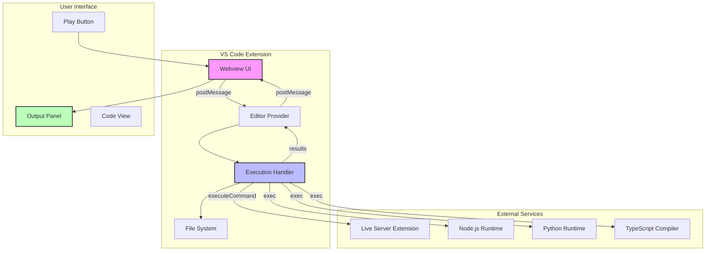

### Component Hierarchy

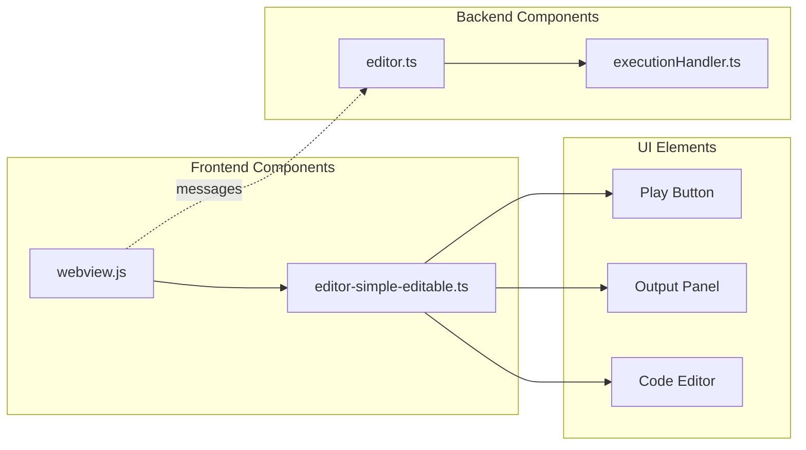

## Component Structure

### File Structure Diagram

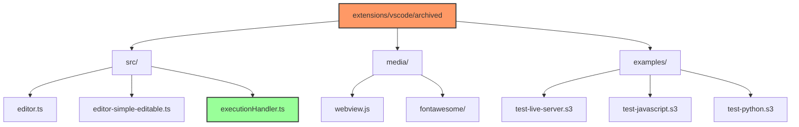

## Data Flow

### Execution Flow Sequence

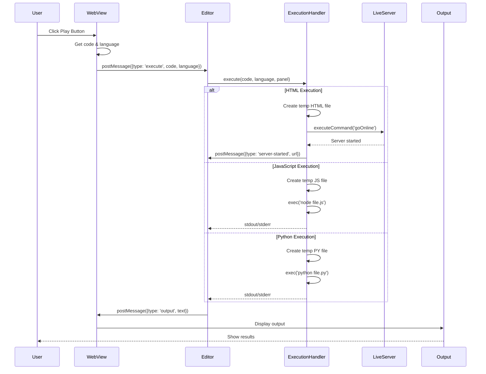

### Message Flow Diagram

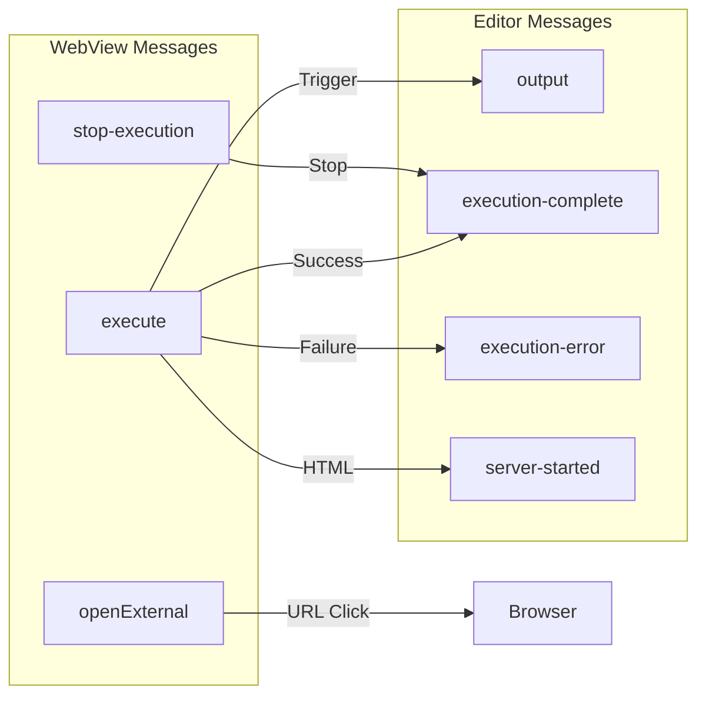

## Implementation Details

### 1. Output Panel Implementation

**Location**: `src/editor-simple-editable.ts`

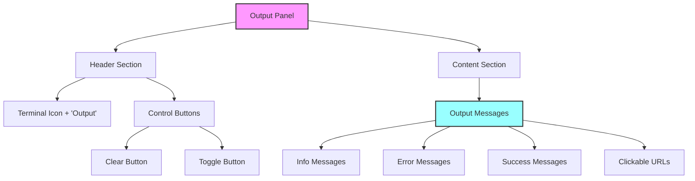

**Key Features**:
- CSS Styles: Lines 354-475
- HTML Structure: Lines 513-531
- Collapsible functionality
- Theme-aware styling
- Message type differentiation

### 2. Play Button Enhancement

**Location**: `media/webview.js`

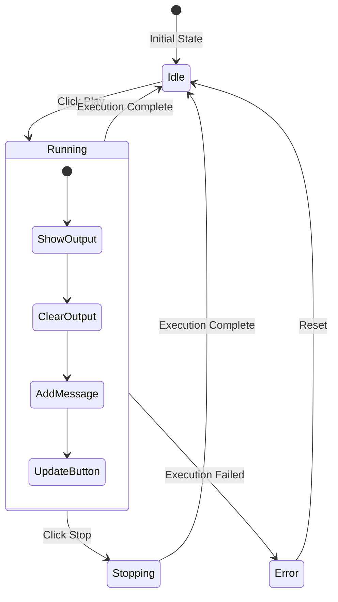

**Key Functions**:
- `playButton.addEventListener` (Lines 326-368)
- `showOutputPanel()` (Lines 392-402)
- `addOutputMessage()` (Lines 421-452)
- `resetPlayButton()` (Lines 475-484)

### 3. Execution Handler

**Location**: `src/executionHandler.ts`

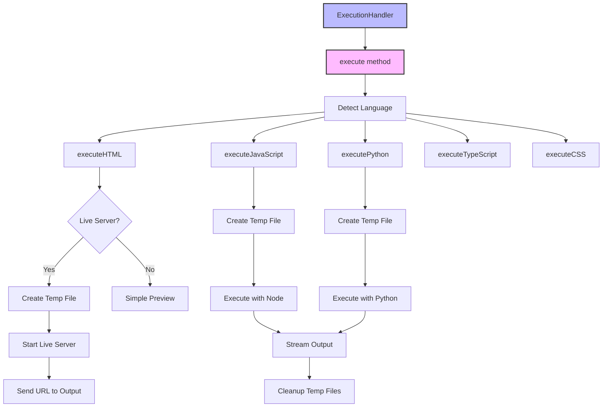

**Methods**:
- `execute()` - Main entry point (Lines 17-49)
- `executeHTML()` - Live Server integration (Lines 54-110)
- `executeJavaScript()` - Node.js execution (Lines 127-168)
- `executePython()` - Python execution (Lines 173-221)
- `executeTypeScript()` - TypeScript execution (Lines 226-299)
- `stopExecution()` - Resource cleanup (Lines 330-347)

### 4. Editor Integration

**Location**: `src/editor.ts`

**Modifications**:
1. **Import ExecutionHandler** (Line 3)
2. **Add handler instance** (Line 190)
3. **Initialize in constructor** (Lines 207-209)
4. **Handle execute message** (Lines 1121-1135)
5. **Handle stop-execution** (Lines 1136-1150)
6. **Cleanup on dispose** (Lines 1076-1080)

## User Interaction Flow

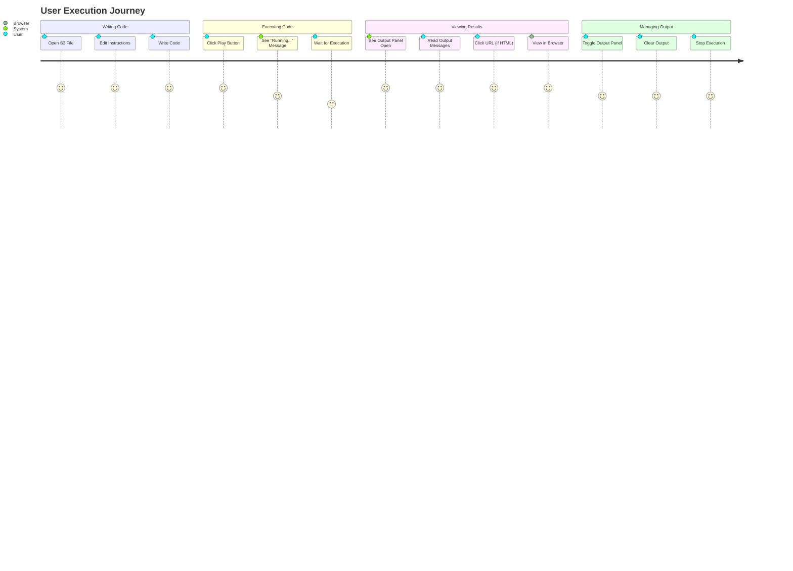

## Message Protocol

### WebView to Editor Messages

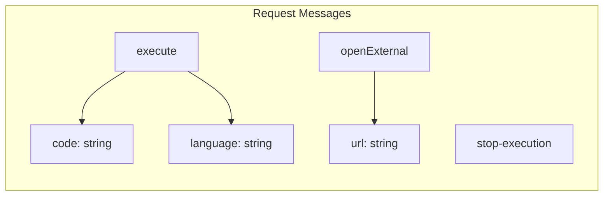

### Editor to WebView Messages

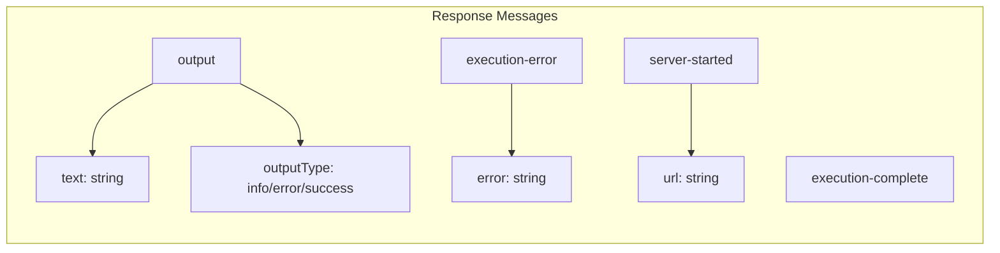

## File Modifications

### Modified Files

| File | Lines Modified | Purpose |
|------|---------------|---------|
| `editor-simple-editable.ts` | 354-475, 513-531 | Added output panel UI and styles |
| `webview.js` | 323-484 | Enhanced play button, added output management |
| `editor.ts` | 3, 190, 207-209, 1076-1080, 1121-1150 | Integrated ExecutionHandler |

### New Files Created

| File | Lines | Purpose |
|------|-------|---------|
| `executionHandler.ts` | 352 | Core execution logic for all languages |
| `LIVE_SERVER_INTEGRATION.md` | 145 | User documentation |
| `test-live-server.s3` | 105 | HTML demo with Live Server |
| `test-javascript.s3` | 48 | JavaScript execution demo |
| `test-python.s3` | 68 | Python execution demo |

## Technical Specifications

### Dependencies

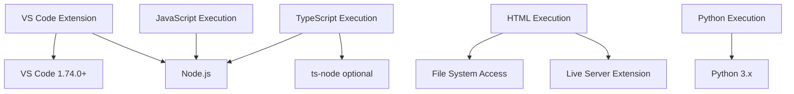

### Resource Management

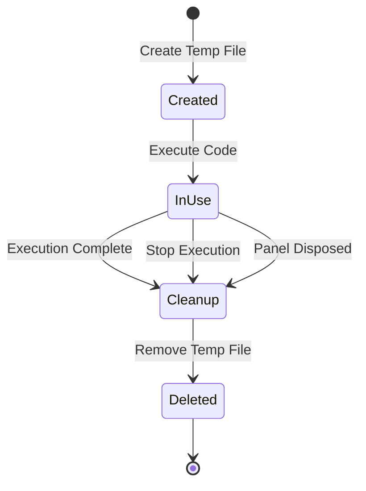

### Error Handling

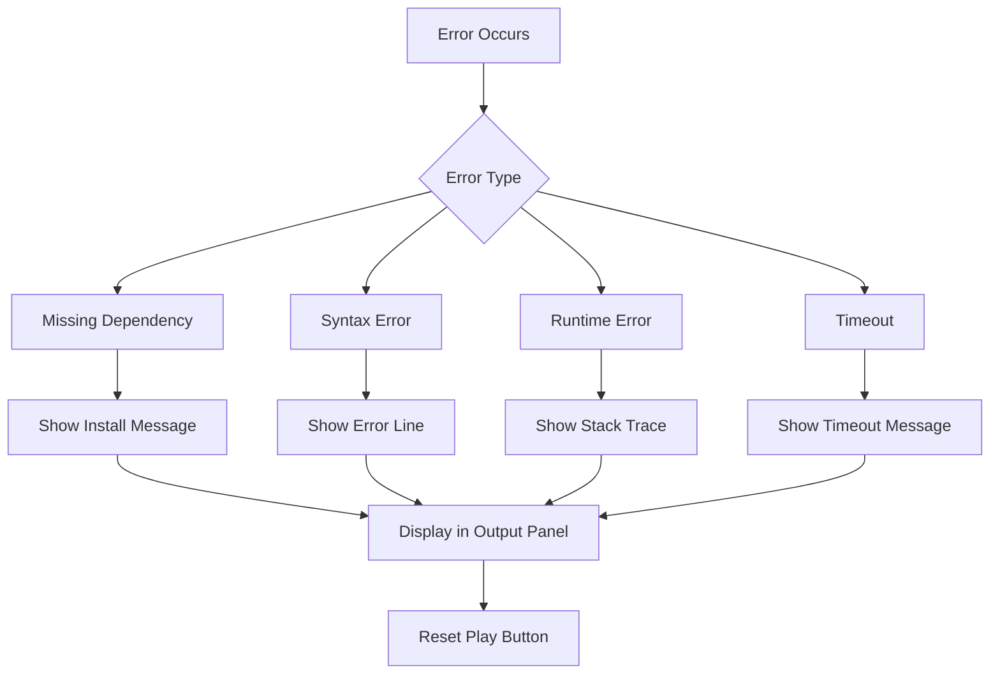

## Summary

The implementation successfully integrates Live Server functionality with the Software 3.0 VS Code extension, providing:

1. **Seamless Execution**: One-click code execution for multiple languages
2. **Live Preview**: Automatic Live Server launch for HTML files
3. **Real-time Feedback**: Streaming output display with type differentiation
4. **User-Friendly UI**: Collapsible output panel with clear visual indicators
5. **Robust Error Handling**: Graceful fallbacks and informative error messages
6. **Resource Management**: Automatic cleanup of temporary files and processes

The system uses VS Code's webview API for UI, Node.js child processes for execution, and integrates with the Live Server extension for HTML preview, creating a comprehensive development environment within the S3 file format.